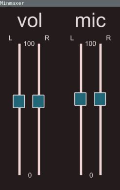

# minmaxer

Barebones gui to FreeBSD's `mixer` utility implemented in Haskell with SDL2.
Developed for personal use.


# Installation
Needs [stack](https://docs.haskellstack.org/en/stable/README/) 
and [SDL2](https://www.libsdl.org/download-2.0.php) to build.
```
git clone https://github.com/Ivarz/minmaxer
cd minmaxer && stack install
```


